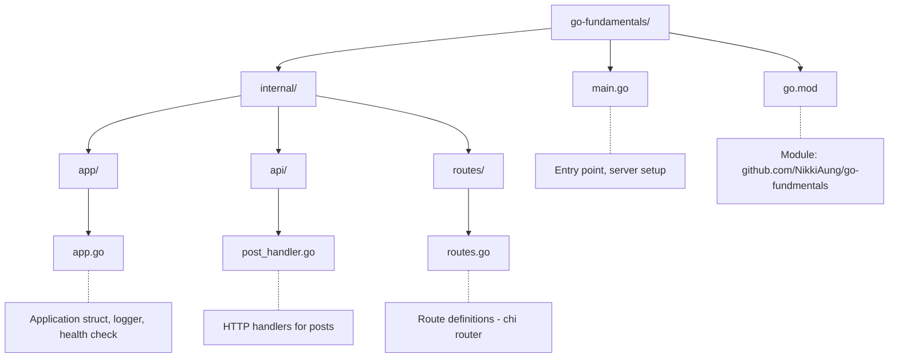
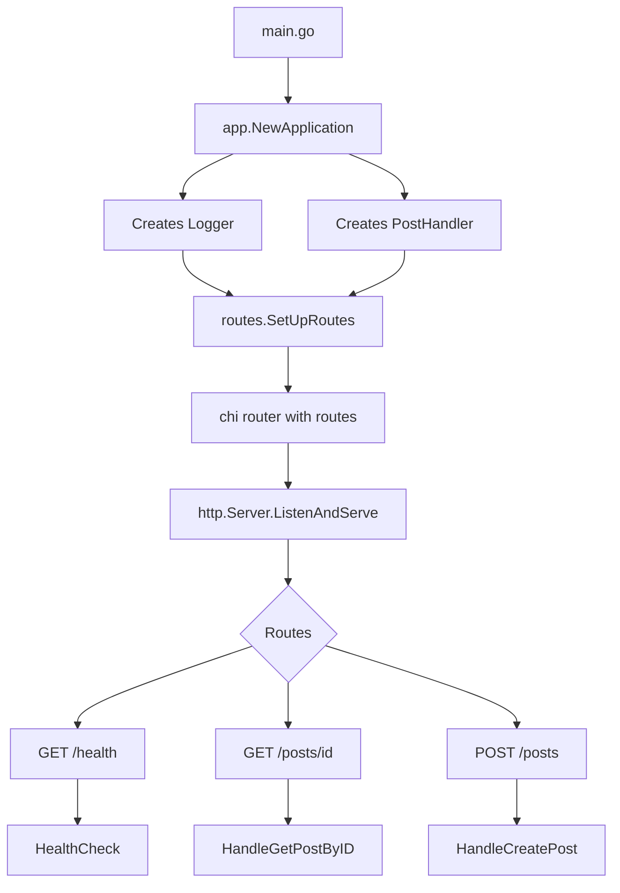

## Project Structure

```mermaid
graph TD
    A[go-fundamentals/] --> B[main.go]
    A --> C[go.mod]
    A --> D[internal/]

    D --> E[app/]
    D --> F[api/]
    D --> G[routes/]

    E --> H[app.go]
    F --> I[post_handler.go]
    G --> J[routes.go]

    B -.- B1[Entry point, server setup]
    C -.- C1[Module: github.com/NikkiAung/go-fundmentals]
    H -.- H1[Application struct, logger, health check]
    I -.- I1[HTTP handlers for posts]
    J -.- J1[Route definitions - chi router]
```

## Application Flow

```mermaid
flowchart TD
    A[main.go] --> B[app.NewApplication]
    B --> B1[Creates Logger]
    B --> B2[Creates PostHandler]

    B1 & B2 --> C[routes.SetUpRoutes]
    C --> D[chi router with routes]

    D --> E[http.Server.ListenAndServe]

    E --> F{Routes}
    F --> G[GET /health]
    F --> H[GET /posts/id]
    F --> I[POST /posts]

    G --> G1[HealthCheck]
    H --> H1[HandleGetPostByID]
    I --> I1[HandleCreatePost]
```
